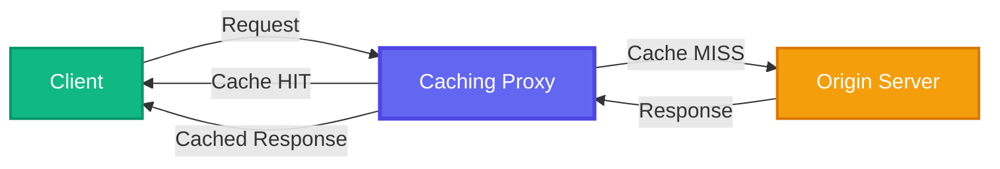
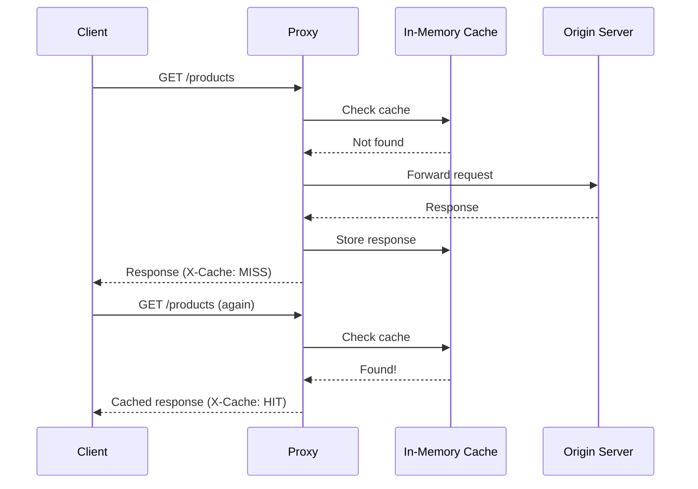

<div align="center">

<p align="center">
  
</p>

  # 🚀 Caching Proxy
  
  **A high-performance CLI-based caching proxy server with real-time visualization**
  
  [](https://nodejs.org/)
  [](https://reactjs.org/)
  [](https://expressjs.com/)
  [](https://www.docker.com/)
  [](./LICENSE)
  
  <p align="center">
    <a href="#-features">Features</a> •
    <a href="#-quick-start">Quick Start</a> •
    <a href="#-usage">Usage</a> •
    <a href="#-screenshots">Screenshots</a> •
    <a href="#-architecture">Architecture</a>
  </p>
</div>

```diff
+ ──────────────────────────────────────────────────────────────────────────────
```

## 🎯 What It Does

**Caching Proxy** is an intelligent middleware that sits between your client and origin server, caching responses to dramatically reduce latency and bandwidth usage. Perfect for learning about caching mechanisms, proxy patterns, and building performant applications.



### 💡 The Magic

<table>
<tr>
<td width="50%">

**First Request** ❌ **MISS**
```
Client → Proxy → Origin Server
        ↓
     [Cache]
```
Fetches from origin and caches

</td>
<td width="50%">

**Subsequent Requests** ✅ **HIT**
```
Client → Proxy
        ↓
     [Cache] ✓
```
Instant response from cache

</td>
</tr>
</table>

```diff
+ ──────────────────────────────────────────────────────────────────────────────
```

## ✨ Features

<div align="center">

| 🎨 Feature | 📝 Description |
|------------|---------------|
| ⚡ **Lightning Fast** | In-memory caching for instant responses |
| 🖥️ **CLI-Based** | Simple command-line interface |
| 🎯 **Smart Headers** | `X-Cache: HIT/MISS` status tracking |
| 🎨 **Visual Dashboard** | Beautiful React frontend with real-time cache visualization |
| 🐳 **Docker Ready** | One-command containerized deployment |
| 🔄 **Auto-Refresh** | Real-time cache status updates |
| 🧹 **Cache Control** | Easy cache clearing via CLI |
| 📦 **Zero Config** | Works out of the box |

</div>

```diff
+ ──────────────────────────────────────────────────────────────────────────────
```

## 🚀 Quick Start

### Prerequisites

```bash
✓ Node.js v18 or higher
✓ npm or yarn
✓ (Optional) Docker & Docker Compose
```

### Installation

<details open>
<summary><b>📦 Method 1: Local Installation (Recommended)</b></summary>

```bash
# Clone the repository
git clone https://github.com/yourusername/caching-proxy.git
cd caching-proxy

# Install backend dependencies
cd backend
npm install

# Install frontend dependencies
cd ../frontend
npm install
```

</details>

<details>
<summary><b>🐳 Method 2: Docker (One-Click Setup)</b></summary>

```bash
# Clone and run
git clone https://github.com/yourusername/caching-proxy.git
cd caching-proxy
docker compose up --build
```

</details>

```diff
+ ──────────────────────────────────────────────────────────────────────────────
```

## 💻 Usage

### 🔧 Backend (Proxy Server)

```bash
cd backend

# Start the proxy server
node cli.js --port 3000 --origin http://dummyjson.com

# Clear cache
node cli.js --clear-cache
```

**Server runs on:** `http://localhost:3000`

#### Available Options

| Flag | Description | Example |
|------|-------------|---------|
| `--port` | Port number for proxy | `--port 3000` |
| `--origin` | Origin server URL | `--origin http://api.example.com` |
| `--clear-cache` | Clear all cached data | `--clear-cache` |

### 🌐 Frontend (Dashboard)

```bash
cd frontend

# Start development server
npm run dev

# Build for production
npm run build
```

**Dashboard runs on:** `http://localhost:5173`

```diff
+ ──────────────────────────────────────────────────────────────────────────────
```

────────────────────────────────────────────────────────────────────────
```

## 🏗️ Architecture

### 📁 Project Structure

```
caching-proxy/
│
├── 📂 backend/
│   ├── cli.js              # CLI entry point
│   ├── index.js            # Server setup
│   ├── proxy.js            # Proxy logic
│   ├── cache.js            # Cache management
│   └── package.json
│
├── 📂 frontend/
│   ├── 📂 src/
│   │   ├── App.jsx         # Main React component
│   │   └── main.jsx        # React entry point
│   ├── index.html
│   ├── package.json
│   └── vite.config.js
│
├── 📂 assets/
│   ├── logo.svg            # Project logo
│   ├── cache-hit.png       # Screenshot - HIT
│   ├── cache-miss.png      # Screenshot - MISS
│   └── dashboard.png       # Dashboard overview
│
├── Dockerfile              # Backend container
├── docker-compose.yml      # Multi-container setup
├── .gitignore
└── README.md
```

### 🔄 How Caching Works

<div align="center">



</div>

**Cache Key Generation:**
```javascript
Key = Request Path + Query Parameters

Examples:
  /products           → "GET:/products"
  /products/1         → "GET:/products/1"
  /products?limit=10  → "GET:/products?limit=10"
```

```diff
+ ──────────────────────────────────────────────────────────────────────────────
```

## 🎓 Learning Outcomes

By exploring this project, you'll understand:

- ✅ How caching proxies work in real-world applications
- ✅ HTTP header manipulation and custom headers
- ✅ In-memory data structures for caching
- ✅ CLI tool development with Node.js
- ✅ Full-stack application architecture
- ✅ Docker containerization
- ✅ React frontend with state management

```diff
+ ──────────────────────────────────────────────────────────────────────────────
```

## 🧪 API Examples

### Testing Cache Behavior

```bash
# First request - MISS
curl -i http://localhost:3000/products
# X-Cache: MISS

# Second request - HIT
curl -i http://localhost:3000/products
# X-Cache: HIT

# Different endpoint - MISS
curl -i http://localhost:3000/products/1
# X-Cache: MISS

# With query params
curl -i http://localhost:3000/products?limit=5
# X-Cache: MISS (first time)

# Same query - HIT
curl -i http://localhost:3000/products?limit=5
# X-Cache: HIT
```

```diff
+ ──────────────────────────────────────────────────────────────────────────────
```

## 🐳 Docker Commands

```bash
# Build and start all services
docker compose up --build

# Run in detached mode
docker compose up -d

# View logs
docker compose logs -f

# Stop services
docker compose down

# Remove volumes
docker compose down -v
```

```diff
+ ──────────────────────────────────────────────────────────────────────────────
```

## 🛠️ Configuration

### Backend Environment Variables

Create a `.env` file in the `backend/` directory:

```env
PORT=3000
ORIGIN_URL=http://dummyjson.com
CACHE_TTL=3600
```

### Frontend Environment Variables

Create a `.env` file in the `frontend/` directory:

```env
VITE_API_URL=http://localhost:3000
```

```diff
+ ──────────────────────────────────────────────────────────────────────────────
```

## 🚧 Roadmap

- [x] Basic caching functionality
- [x] CLI interface
- [x] React dashboard
- [x] Docker support
- [ ] Redis integration for persistent caching
- [ ] Cache TTL (Time To Live) configuration
- [ ] Cache size limits
- [ ] Analytics dashboard
- [ ] Request/response logging
- [ ] Rate limiting
- [ ] Authentication

```diff
+ ──────────────────────────────────────────────────────────────────────────────
```

## 🚧 Problem Statement

**Project Challenge:** https://roadmap.sh/projects/caching-server

<div align="center">

<p align="center">
  
</p>


[](https://github.com/yourusername/caching-proxy/stargazers)
[](https://github.com/yourusername/caching-proxy/network/members)


</div>
